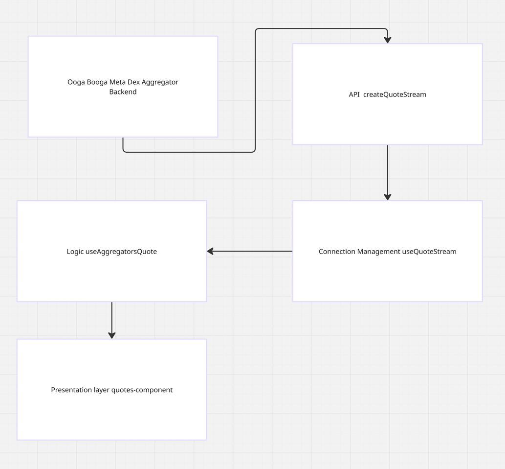
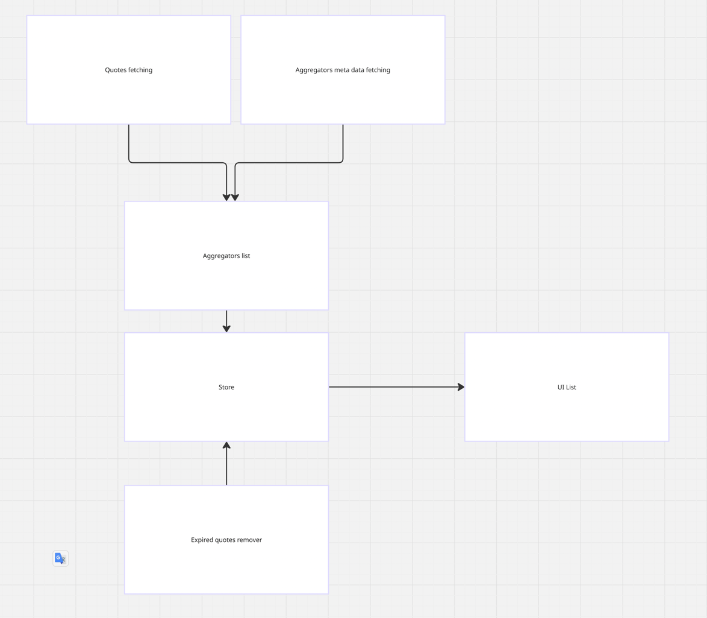
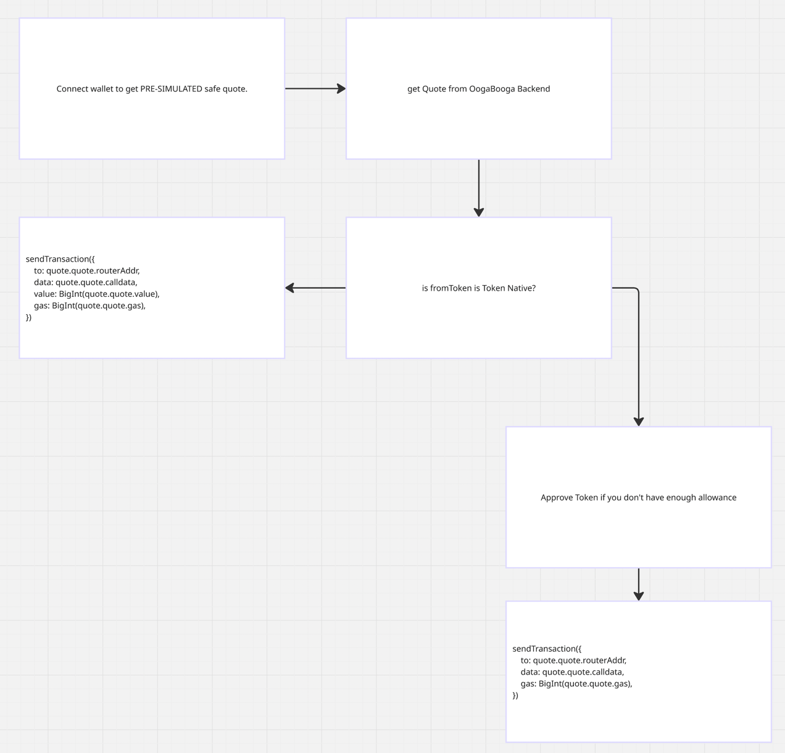

# 🚀 Meta Aggregator Quote Streaming Tutorial

A **Next.js** tutorial demonstrating how to connect to and stream real-time data from the **Ooga Booga Meta Dex Aggregator API** using Server-Sent Events (SSE).

## 📋 Table of Contents

- [📚 Key Concepts](#-key-concepts)
  - [🌐 Quote Stream API](#-quote-stream-api)
  - [📡 Event Types](#-event-types)
  - [📊 Quote Data Structure](#-quote-data-structure)
- [🔧 Usage Examples](#-usage-examples)
- [🛠️ Getting Started](#️-getting-started)
- [⚠️ Important: Wallet Connection](#️-important-wallet-connection)
- [💡 Examples](#-examples)
  - [1. Meta Aggregator Quote Streaming](#1-meta-aggregator-quote-streaming)
  - [2. Dynamic Token List](#2-dynamic-token-list)
  - [3. Send Transaction](#3-send-transaction)
- [📄 License](#-license)

---

## 📚 Key Concepts

### 🌐 Quote Stream API

The application connects to a streaming API for real-time swap quotes:

```typescript
const AGGREGATOR_BASE_URL = 'https://hyperevm.internal.oogabooga.io'
```

#### Supported Parameters

| Parameter | Type | Description |
|-----------|------|-------------|
| `tokenIn` | string | Input token address |
| `tokenOut` | string | Output token address |
| `amount` | string | Amount to swap (in token units) |
| `maxSlippage` | string | Maximum acceptable slippage (default: 0.01) |
| `to` | string | Recipient address |
| `aggregators` | string[] | Specific aggregators to query |

### 📡 Event Types

The SSE stream emits the following events:

- **`connected`** - Initial connection established
- **`quote`** - New quote data received
- **`error`** - Error occurred during streaming
- **`heartbeat`** - Keep-alive signal

### 📊 Quote Data Structure

Each quote contains comprehensive swap information:

```typescript
interface QuoteResponse {
  aggregator: string;
  quote: {
    status: string;
    amountIn: string;
    amountOut: string;
    fee: string;
    value: string;
    aggregator: string;
    routerAddr: string;
    calldata: string;
    gas: string;
    simulationAmountOut: string;
    priceImpact: number;
  };
  timestamp: number;
}
```

## 🔧 Usage Examples

### Basic Quote Stream Implementation

```typescript
import { useQuoteStream } from '@/hooks/use-quote-stream'

const QuoteStreamComponent = () => {
  const { isConnected, latestQuote, error } = useQuoteStream({
    chainId: 999, // HyperEVM chain ID
    params: {
      tokenIn: '0xB8CE59FC3717ada4C02eaDF9682A9e934F625ebb', // USDT
      tokenOut: '0x0000000000000000000000000000000000000000', // HYPE
      amount: '10000000', // 10 USDT
      maxSlippage: '0.5',
    },
    enabled: true
  })

  if (!isConnected) {
    return <div>🔄 Connecting to quote stream...</div>
  }
  
  if (error) {
    return <div>❌ Error: {error.message}</div>
  }
  
  return (
    <div>
      <h3>📊 Latest Quote</h3>
      <pre>{JSON.stringify(latestQuote, null, 2)}</pre>
    </div>
  )
}
```

---

## 🛠️ Getting Started

### Prerequisites

- Node.js 18+ installed
- Package manager (npm, yarn, pnpm, or bun)

### Installation

```bash
# Clone the repository
git clone <repository-url>
cd meta-agg-fe-tutorial

# Install dependencies
npm install
# or
yarn install
# or
pnpm install
```

### Running the Development Server

```bash
npm run dev
# or
yarn dev
# or
pnpm dev
# or
bun dev
```

Open [http://localhost:3000](http://localhost:3000) to see the application running.

---

## ⚠️ Important: Wallet Connection

> **🔒 Connect your wallet to get real, pre-simulated pricing from the Ooga Booga backend.**
> 
> **Without wallet connection, quotes may be spoofed or manipulated by aggregators.** Connected wallets receive verified quotes that reflect actual execution prices.

---

## 💡 Examples

### 1. Meta Aggregator Quote Streaming



This example shows how to stream real-time swap quotes from multiple aggregators simultaneously.

#### Architecture Overview

**🏗️ Backend Infrastructure**
- **Ooga Booga Meta Dex Aggregator**: Service providing real-time swap quotes
- **Server-Sent Events**: Streaming infrastructure for live updates

**📁 Frontend Components**
1. **API Layer** (`src/api/meta-stream-api.ts`)
   - Manages SSE connections to the aggregator API
   - Handles quote stream parameters and events

2. **Connection Management** (`src/hooks/use-quote-stream.ts`)
   - React hook for managing quote streams
   - Event subscription and cleanup lifecycle

3. **Business Logic** (`src/hooks/use-aggregators-quote.ts`)
   - Preconfigured hook for USDT/HYPE quotes
   - Built on top of `useQuoteStream`

4. **UI Components** (`src/components/`)
   - React components for displaying quote data

> **✅ That's everything you need to get started with streaming quotes!**

---

### 2. Dynamic Token List



Demonstrates how to fetch and display available aggregators and their supported token pairs in real-time.

#### Architecture Overview

**🏗️ Backend Infrastructure**
- **Aggregators Registry**: Service providing real-time aggregator information
- **Token Pair Discovery**: Availability across different DEX protocols

**📁 Frontend Components**
1. **API Layer** (`src/api/api.ts`)
   - HTTP requests to the aggregators registry endpoint
   - Data fetching and caching

2. **Data Management** (`src/hooks/use-aggregators-list.ts`)
   - React hook for fetching aggregator data
   - Real-time updates and error handling

3. **UI Components** (`src/components/aggregators-list/`)
   - Interactive aggregator information display
   - Token pair selection and filtering

---

### 3. Send Transaction



Complete end-to-end swap implementation using Meta Aggregator quotes with wallet connection, token approval, and transaction execution.

#### Architecture Overview

**📁 Main Components** (`src/components/transaction-example/`)

**🔧 Core Components**
- `transaction-example.tsx` - Root wrapper with wallet provider
- `transaction-example-content.tsx` - Main logic and state management
- `wallet-provider.tsx` - Wagmi and RainbowKit configuration
- `wagmi-config.ts` - HyperEVM chain configuration and wallet setup

**🎨 UI Components**
- `header.tsx` - Connection status and wallet connect button
- `quote-display.tsx` - Quote data and action buttons
- `approval-status.tsx` - Token approval status and progress

---

## 📄 License

This project is licensed under the terms specified in the [LICENSE](LICENSE) file.
